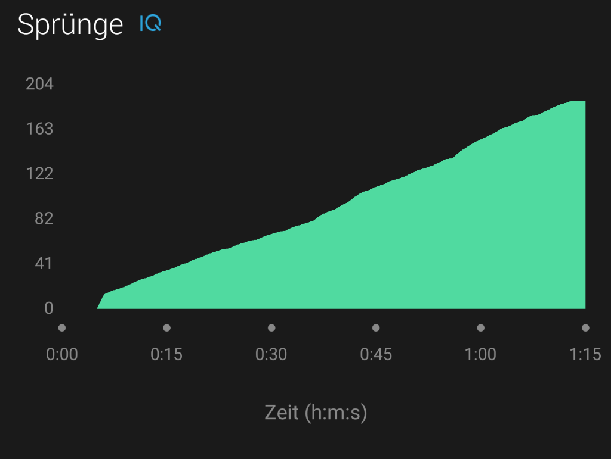

# Jumps 

## Garmin Connect IQ datafiled for counting jumps during Jump Rope activities

Download at: [Garmin Connect IQ](https://apps.garmin.com/en-US/apps/539e6c9e-a735-45c6-b390-c0bc65c1d65a)

 

### Setup
* Copy Cardio activity and rename it to "Jump Rope" (or whatever you´d like)
* Add Jumps to your Data Screen (please refer to your watch manual: https://support.garmin.com/support/manuals/searchManuals.faces?refresh=true)
* Start the activity and calibrate the multiplier (jump 100 times and see what´s displayed, then use the formula: multiplier=100/"jumps displayed"
* Adjust multiplier if necessary
* Start jumping!

### Description
This datafield is based on the open source [PoleSteps to FIT](https://github.com/rgergely/polesteps) steps datafield with a multiplier. The multiplier can be configured through the Connect IQ phone application or the Garmin Express PC software.
The differences are:
* jumps counted instead of steps
* Connect IQ graphs for total jumps, jumps per minute, and seconds per jump
* Jumping Effect (see explanation below)
* Choose between 4 types of data to display: jumps, jumps per minute, seconds per jump, and jumping effect (also displayed in summary/charts)

##### Jumping Effect: indicates how hard you trained.
A value of 100 is equivalent to jumping 20 minutes non-stop at a 120+ jpm pace.

You don´t need to be fast to lose weight, all of these are equivalent in term of calories burned:
 * 20 minutes at 120jpm (MET=12.3)
 * 21 minutes at 100 jpm (MET=11.8)
 * 28 minutes at 80 jpm (MET=8.8)
 
This index makes it easier to compare how hard your training was with your friends.

This is based on the MET (Metabolic Equivalent) for rope jumping as a function of the pace.
[source](https://sites.google.com/site/compendiumofphysicalactivities/Activity-Categories/sports)

#####A big Thank you to rgergely for making his code available!
PoleSteps can be downloaded here: [PoleSteps to FIT](https://apps.garmin.com/en-US/apps/fc007f07-cac0-4d5d-a411-e4a34840f57e). 
The original datafield without the multiplier can be downloaded from this location: [Steps to FIT](https://apps.garmin.com/en-US/apps/eb7018d6-3a13-4530-92ec-ed51d1f56e07)

### What’s New
* v0.3.0 add jumping effect.
* v0.2.0 optimize charts, refactor code, ignore data if more than 8 jps.
* v0.1.1 remove Math import for older devices (e.g. F3-HR), eliminate peaks in jpm.
* v0.1.0 add timespan setting for averages.
* v0.0.7 little tweaks for 5s averages.
* v0.0.6 last 5s average for "jumps per minute" and "seconds per jump" charts.
* v0.0.5 add "jumps per minute" and "seconds per jump" charts.
* v0.0.4 add total jumps to activity summary.
* v0.0.3 remove vertical oscillation.
* v0.0.2 save vertical oscillation in FIT file.
* v0.0.1 Initial release.

 Icon from [icons8](https://icons8.de/icons/set/jump-rope")
